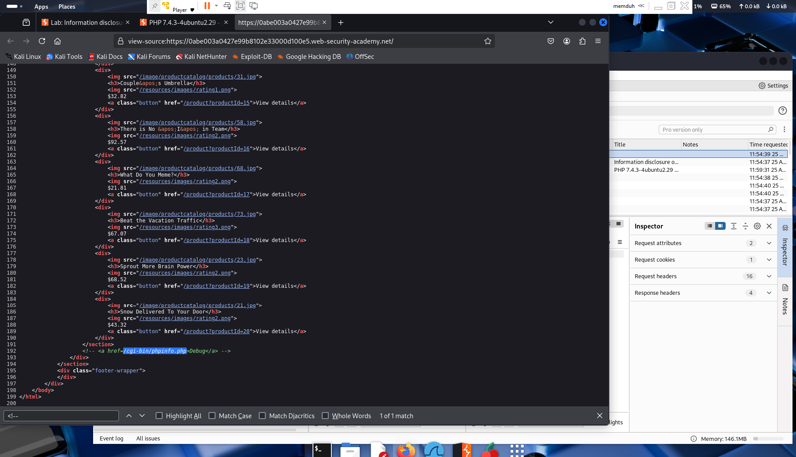
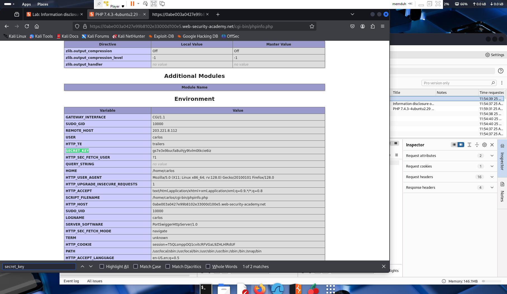

# Lab 03 – Information Disclosure on Debug Page

**Platform:** [PortSwigger Web Security Academy](https://portswigger.net/web-security/information-disclosure/exploiting/lab-info-leak-on-debug-page)  
**Vulnerability Type:** Information Disclosure (Debug Page Exposure)  
**Difficulty:** Apprentice  

---

## 🧠 Summary

This lab demonstrates how a leftover debug interface can expose internal configuration values. In this case, an environment variable containing a secret application key (`SECRET_KEY`) is disclosed via a `phpinfo()` debug page.

---

## 🎯 Objective

Discover and extract the value of the `SECRET_KEY` environment variable exposed on the debug page and submit it to solve the lab.

---

## 🛠 Steps Taken

1. Visited the home page of the lab instance.
2. Opened **Page Source** (Ctrl+U) and found an HTML comment:
   ```
   <!-- Debug: /cgi-bin/phpinfo.php -->
   ```
3. Navigated to the `/cgi-bin/phpinfo.php` URL manually.
4. Searched for `SECRET_KEY` on the resulting debug output.
5. Located the secret environment variable value.
6. Submitted the value to complete the lab.

---

## 🔍 Key Takeaway

Exposing debug interfaces or configuration pages in production environments can lead to severe information disclosure vulnerabilities. Attackers can use leaked secrets such as API keys, secret tokens, or credentials to escalate attacks.

---

## 📸 Screenshots

### Debug Link in HTML Comment



### SECRET_KEY Found on Debug Page



---

## ✅ Outcome

The `SECRET_KEY` was successfully extracted and submitted, completing the lab.

---

## 💬 What I Learned

- Always remove debug and diagnostic endpoints before deploying to production.
- HTML comments can reveal valuable internal paths to attackers.
- Debug interfaces like `phpinfo()` often leak sensitive environment variables.
