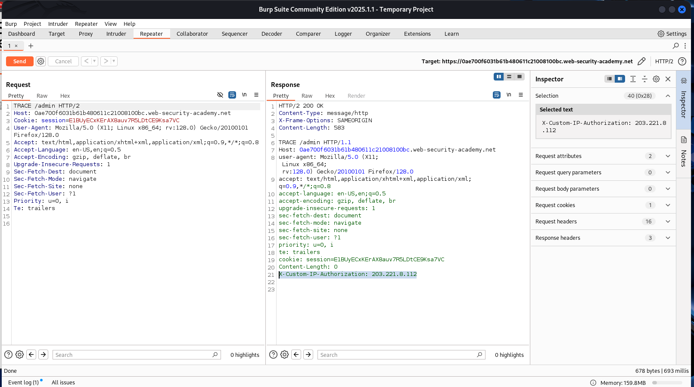
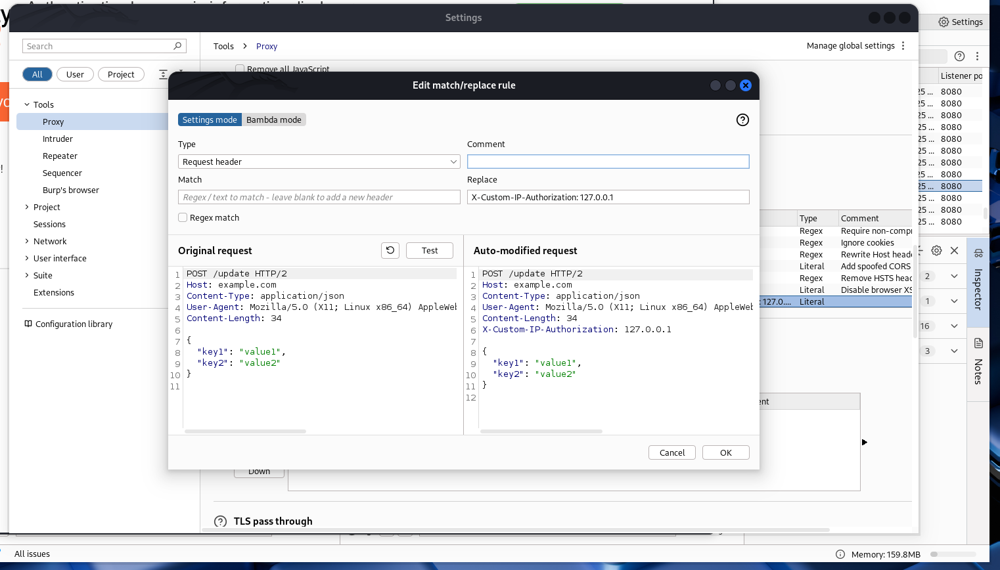
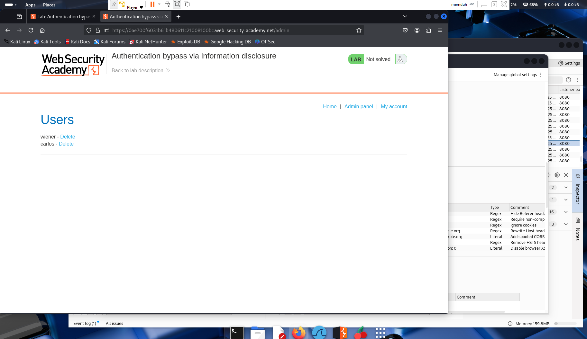

# Lab 04 – Authentication Bypass via Information Disclosure

**Platform:** [PortSwigger Web Security Academy](https://portswigger.net/web-security/information-disclosure/exploiting/lab-authentication-bypass-via-information-disclosure)  
**Vulnerability Type:** Information Disclosure → Authentication Bypass  
**Difficulty:** Apprentice  

---

## 🧠 Summary

This lab demonstrates how information disclosure through debug behavior can be used to bypass access control. A custom HTTP header is leaked via TRACE method, which allows an attacker to impersonate a local IP and gain admin access.

---

## 🎯 Objective

Discover the custom header used by the admin interface to identify local requests. Exploit this header to gain access to the admin panel and delete the user `carlos`.

---

## 🛠 Steps Taken

1. Accessed `/admin` and saw the message:  
   `"Admin interface only available to local users"`
2. Sent a `TRACE /admin` request using Burp Repeater.
3. Observed that the response included a custom header:  
   `X-Custom-IP-Authorization: 203.xxx.xxx.xxx`
4. In **Proxy > Options > Match & Replace**, added a new rule:  
   `X-Custom-IP-Authorization: 127.0.0.1`
5. Returned to the homepage and successfully accessed the `/admin` interface.
6. Deleted the user `carlos` to solve the lab.

---

## 🔍 Key Takeaway

Debug or misconfigured server behavior can disclose internal mechanisms like custom headers. Exploiting these disclosures can lead to serious access control vulnerabilities, especially when authentication depends on easily spoofed values like IP addresses or headers.

---

## 📸 Screenshots

### 1. TRACE Response Showing Leaked Header

### 2. Match & Replace Rule Configuration

### 3. Admin Panel Access with Delete Option

---

## ✅ Outcome

Successfully accessed the admin panel by injecting a spoofed custom header and deleted user `carlos`.

---

## 💬 What I Learned

- TRACE methods can be useful for identifying reflected headers and internal mechanisms.
- Header-based access controls are insecure when not validated properly.
- Burp's Match & Replace tool can simulate complex manipulation of requests efficiently.
