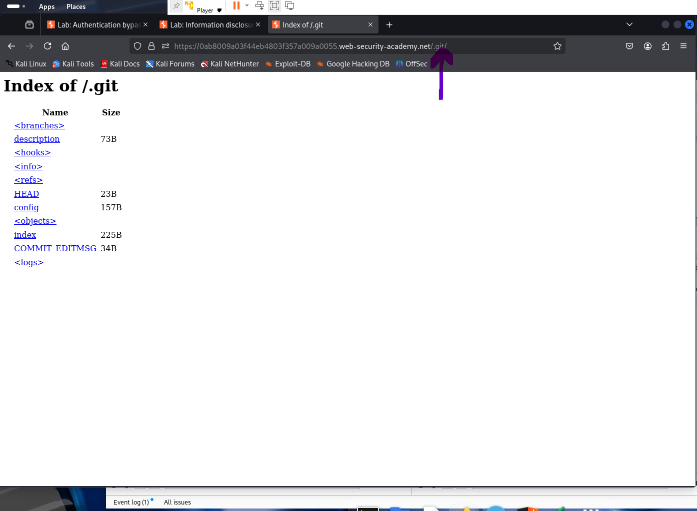
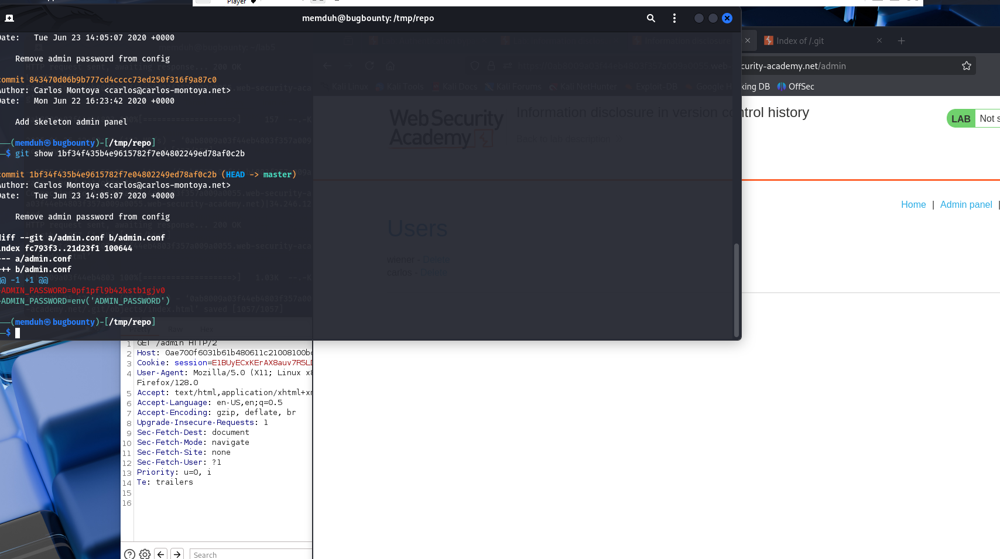
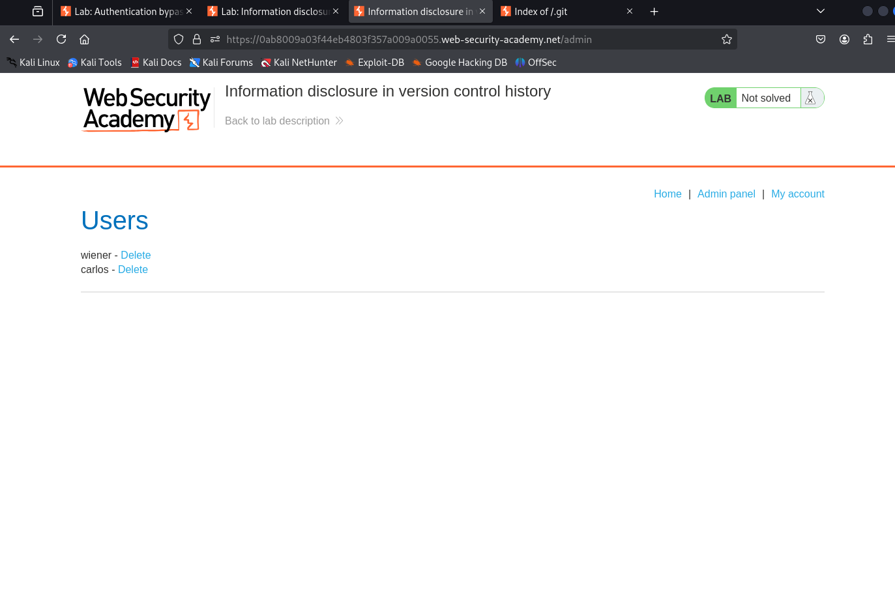

# Lab 05 – Information Disclosure in Version Control History

**Platform:** [PortSwigger Web Security Academy](https://portswigger.net/web-security/information-disclosure/exploiting/lab-information-disclosure-in-version-control-history)  
**Vulnerability Type:** Information Disclosure (Git Version History)  
**Difficulty:** Practitioner  

---

## 🧠 Summary

This lab demonstrates how exposing version control metadata (.git folder) on a live server can leak sensitive information such as credentials. An attacker can reconstruct the project history and extract deleted or overwritten secrets.

---

## 🎯 Objective

Access the `.git/` directory exposed on the web server, recover a previously committed admin password from the Git history, and use it to log in as the administrator and delete user `carlos`.

---

## 🛠 Steps Taken

1. Visited `/.git/` in the browser and verified that directory listing was enabled.
2. Used GitDumper (`gitdumper.sh`) to recursively download the entire `.git/` folder.
3. Reconstructed the Git project using the dumped data.
4. Ran `git log` and found a commit titled "Remove admin password from config".
5. Inspected the commit with `git show <commit-id>` and extracted the deleted admin password.
6. Logged into the admin panel using:
   - **Username:** `administrator`
   - **Password:** `0pf1pfl9b42kstb1gjv0`
7. Accessed the admin interface and deleted user `carlos`.

---

## 🔍 Key Takeaway

Exposing `.git/` directories on live websites is a critical mistake. Attackers can easily recover sensitive information, including credentials and internal logic, even after those values are “removed” from code.

---

## 📸 Screenshots

### 1. Publicly Exposed .git Directory

### 2. Leaked Admin Password in Git Diff

### 3. Admin Panel Access Achieved

---

## ✅ Outcome

Successfully extracted a deleted admin password from Git history and used it to access the admin interface and delete user `carlos`.

---

## 💬 What I Learned

- `.git/` directories should **never** be publicly accessible on production servers.
- Even deleted secrets can still be accessed through Git history.
- Tools like GitDumper make exploitation of such misconfigurations trivial.
