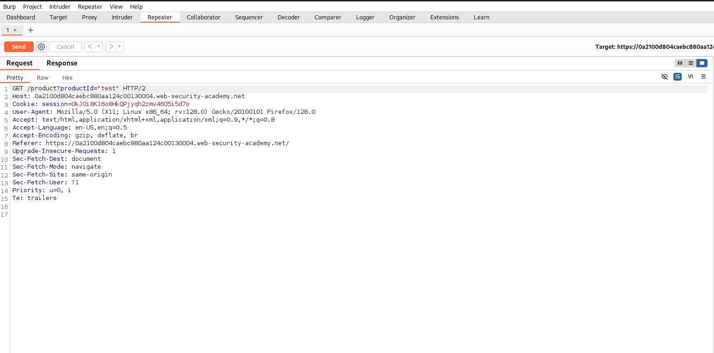
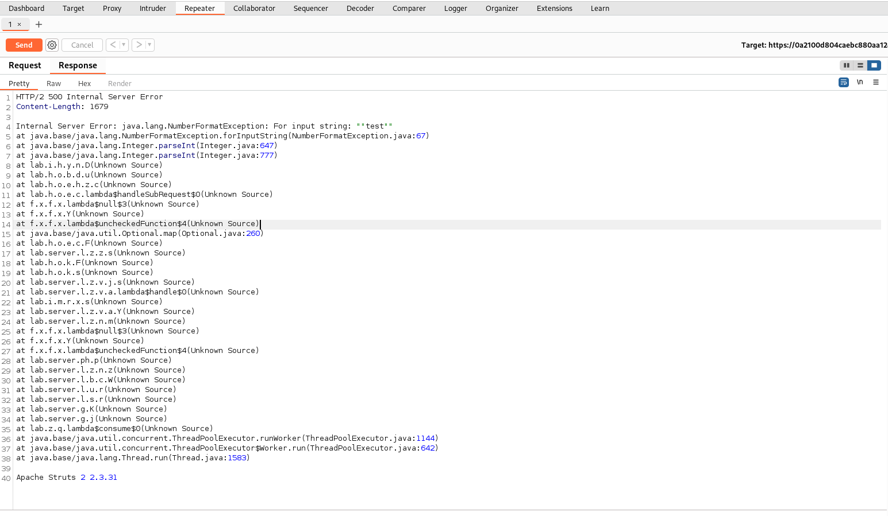

# Lab 01 – Information Disclosure in Error Messages

**Platform:** [PortSwigger Web Security Academy](https://portswigger.net/web-security/information-disclosure/exploiting/lab-info-leak-in-error-messages)  
**Vulnerability Type:** Information Disclosure  
**Difficulty:** Apprentice  

---

## 🧠 Summary

This lab demonstrates an **Information Disclosure** vulnerability caused by verbose error messages. When unexpected input is supplied to the application, it reveals detailed internal error information, including the version of a third-party framework.

---

## 🎯 Objective

Trigger an error that leaks the version number of the Apache Struts framework used by the application. Submit the version to complete the lab.

---

## 🛠 Steps Taken

1. Launched the lab and accessed a product page, which made a request like:
   ```
   GET /product?productId=1
   ```
2. Captured the request in **Burp Suite** using **HTTP History**, then sent it to the **Repeater**.
3. Modified the parameter value to a non-integer string:
   ```
   productId="test"
   ```
4. Observed the server response showing a full stack trace and revealing the framework version.

---

## 🔍 Key Takeaway

The error response included the line:
```
Apache Struts 2 2.3.31
```
This confirms that the system uses Apache Struts 2 version 2.3.31, which might be vulnerable depending on patch status. Even if the version is secure, revealing it can aid attackers in crafting further targeted exploits.

---

## 📸 Screenshots

### Request



### Response



---

## ✅ Outcome

The version number `2.3.31` was submitted successfully, and the lab was marked as completed.

---

## 💬 What I Learned

- Always validate and sanitize user input to prevent unexpected behavior.
- Avoid displaying verbose error messages in production environments.
- Seemingly harmless technical disclosures can serve as critical puzzle pieces for more severe attacks.
