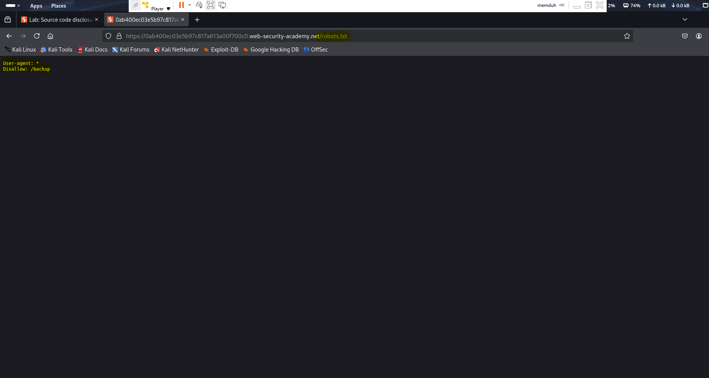
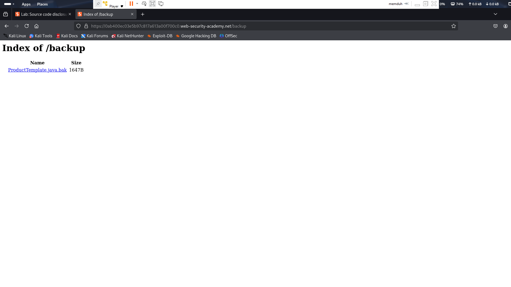
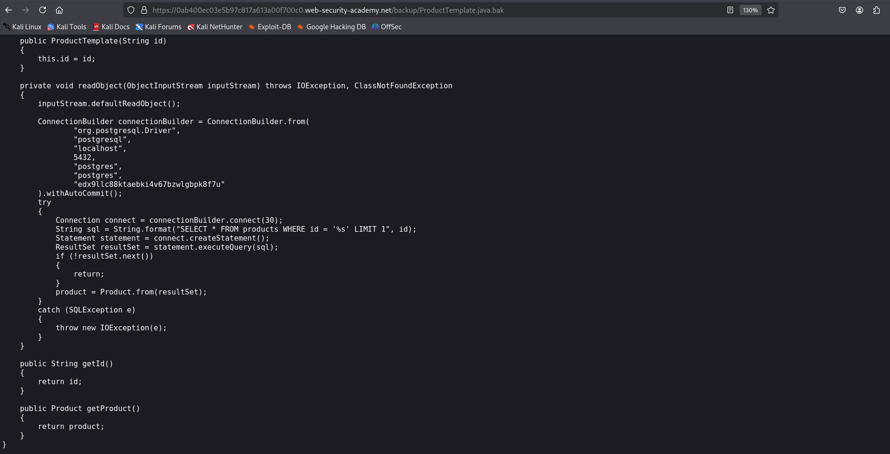

# Lab 02 – Source Code Disclosure via Backup Files

**Platform:** [PortSwigger Web Security Academy](https://portswigger.net/web-security/information-disclosure/exploiting/lab-info-leak-via-backup-files)  
**Vulnerability Type:** Information Disclosure (Source Code Exposure)  
**Difficulty:** Apprentice  

---

## 🧠 Summary

This lab demonstrates how leftover backup files on the web server can unintentionally expose source code. In this case, the source code contains hardcoded credentials to a PostgreSQL database.

---

## 🎯 Objective

Find and extract the hard-coded database password from a leaked backup file located in a hidden directory. Submit the password to solve the lab.

---

## 🛠 Steps Taken

1. Visited `/robots.txt` and discovered `/backup` directory listed.
2. Navigated to `/backup/` and found `ProductTemplate.java.bak` file.
3. Opened the `.bak` file and located a PostgreSQL connection string containing a hardcoded password.
4. Extracted the password and submitted it to complete the lab.

---

## 🔍 Key Takeaway

Neglected backup files such as `.bak`, `.old`, or `.tmp` can expose sensitive credentials and internal logic if not properly removed from production environments.

---

## 📸 Screenshots

### robots.txt

### Backup Directory Listing

### Source Code Password

---

## ✅ Outcome

The database password `edx9llc88ktaebki4v67bzwlgbpk8f7u` was successfully submitted, completing the lab.

---

## 💬 What I Learned

- Backup files should never be exposed on production systems.
- Always verify and sanitize what files are deployed to a live environment.
- Source code can unintentionally leak credentials, highlighting the need for secrets management.
