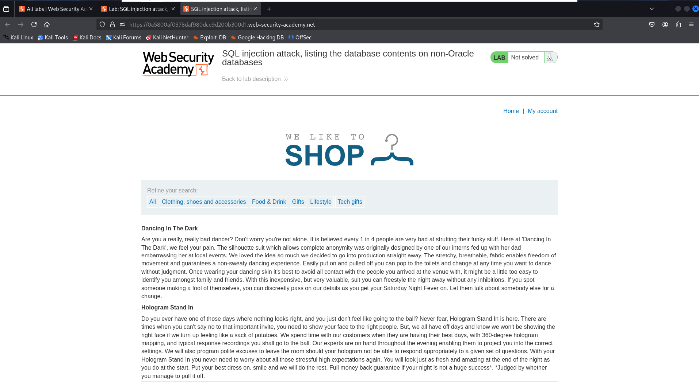
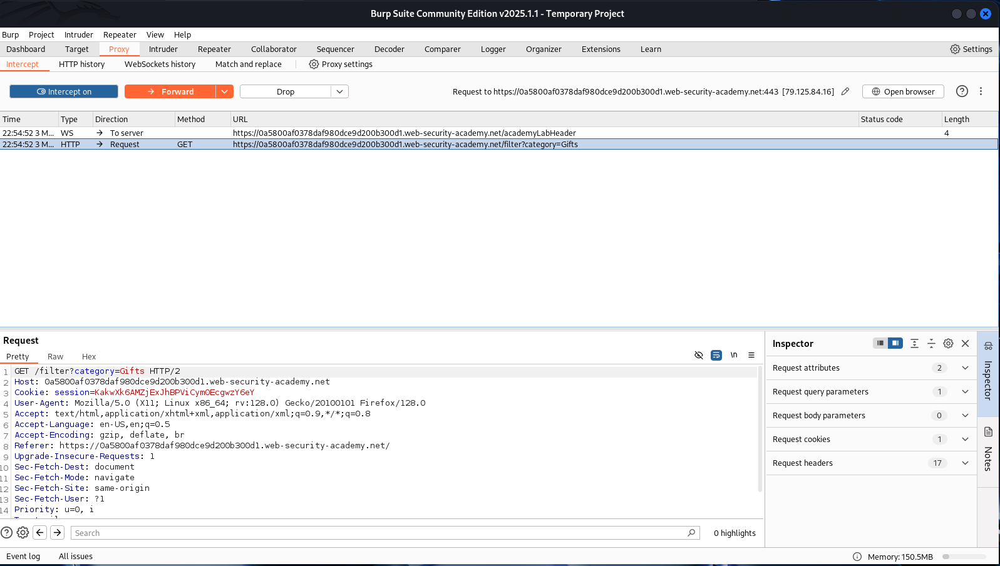
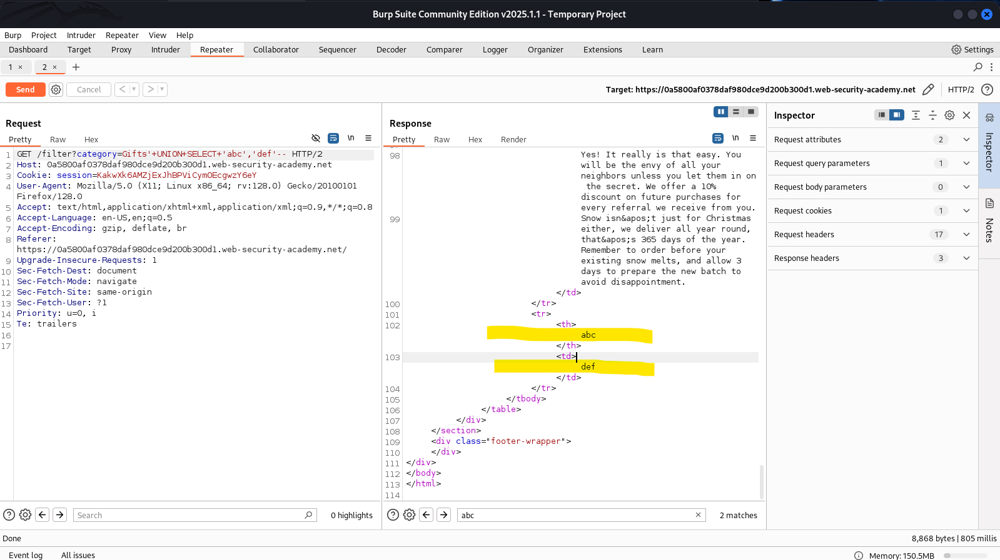
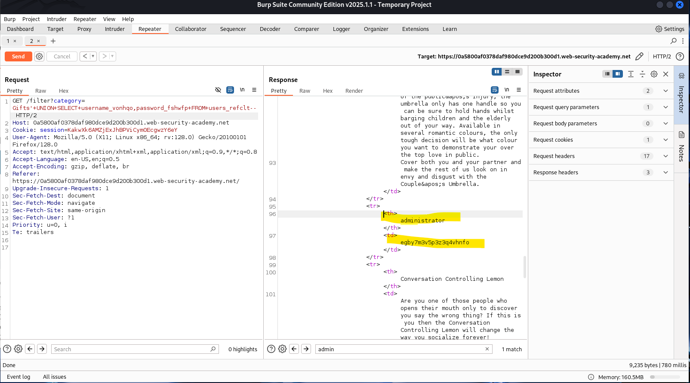
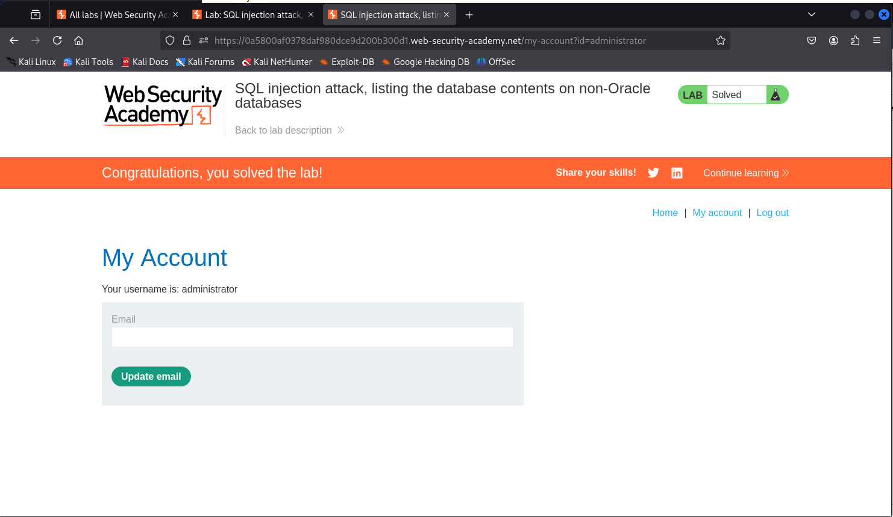

# 💉 SQL Injection: Listing DB Contents on Non-Oracle Databases

This lab demonstrates a **UNION-based SQL injection** vulnerability in the product category filter of a web application. The attack allows retrieving **table names, column names**, and ultimately **user credentials**, by exploiting the `category` parameter.

---

## 🧪 Step 1: Access the Lab

📸  

---

## 🔍 Step 2: Intercept and Identify the Vulnerable Request

We intercepted the request responsible for setting the category filter via Burp Suite.

📸  

---

## 🧱 Step 3: Column Count & Text Detection

We tested how many columns were returned and identified the ones accepting string values.

**Payload:**

📸  

---

## 📋 Step 4: Retrieve Column Names from Users Table

We first found a suspicious table named `users_refclt` by querying:

Then extracted the column names using:

📸  

---

## 👤 Step 5: Extract User Credentials

After identifying the column names `username_vonhqo` and `password_fshwfp`, we dumped the user list:

📸  

---

## ✅ Step 6: Lab Solved

We logged in using the retrieved administrator credentials and solved the lab.

📸  

---

### 🧠 Key Takeaways

- Never directly include unvalidated user input in SQL queries.
- Always use parameterised queries or stored procedures.
- Regularly audit applications for injection points.

---
