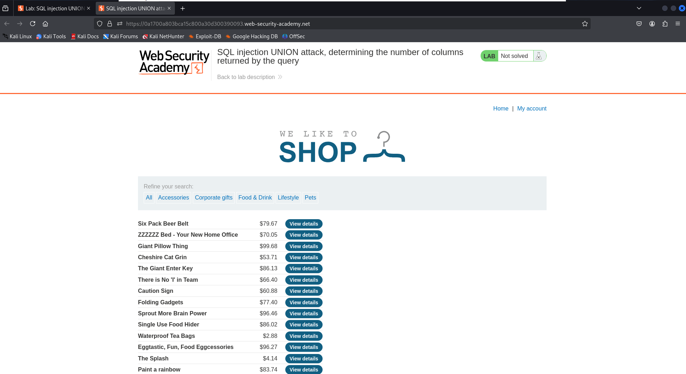
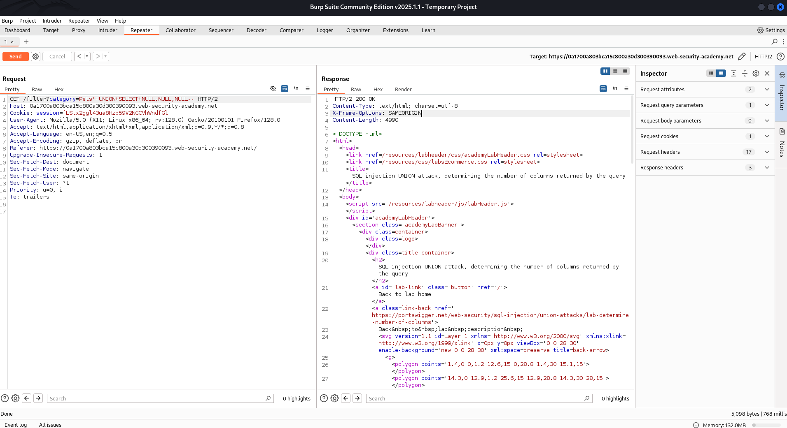
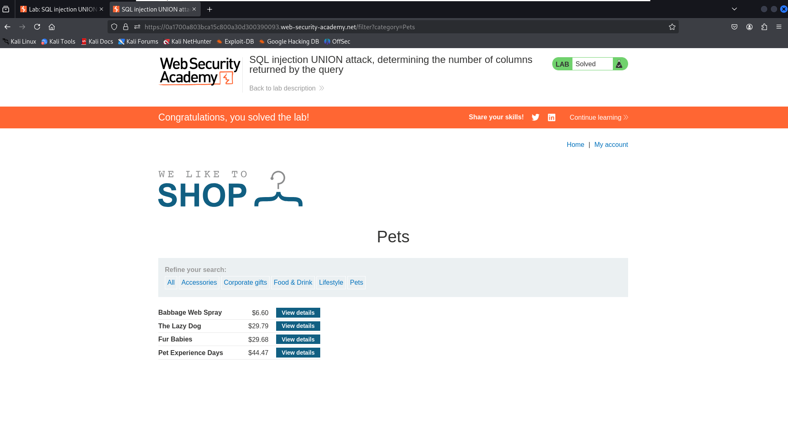

# Lab: SQL injection UNION attack, determining the number of columns returned by the query

This lab demonstrates how to determine the number of columns returned by a vulnerable SQL query using a UNION-based SQL injection. The vulnerability lies in the `category` filter of the e-commerce application.

## 🧠 Lab Objective

Determine the number of columns returned by the original query by performing a UNION SELECT attack that returns `NULL` values until the query executes successfully.

---

## 🛠️ Steps Followed

1. **Access the lab**  
   Navigated to the lab to explore the vulnerable parameter.



2. **Intercepted the HTTP request using Burp Suite**  
   Captured the request containing the `category` parameter.


3. **Sent payload with insufficient columns**  
   Injected the payload `'+UNION+SELECT+NULL--` and observed a 500 Internal Server Error.


4. **Added columns progressively**  
   Modified payload to `'+UNION+SELECT+NULL,NULL,NULL--` until the page loaded successfully and the response included normal content.



5. **Lab solved message appeared**  
   Once correct number of columns identified, lab was automatically marked as solved.



---

## ✅ Final Payload
```
'+UNION+SELECT+NULL,NULL,NULL--
```

---

## 📝 Key Learnings

- Oracle databases require UNION SELECT queries to match the original query’s column count and data types.
- NULLs are safe placeholders when probing the number of columns.
- Observe HTTP status codes and HTML responses to detect success or failure.

---

