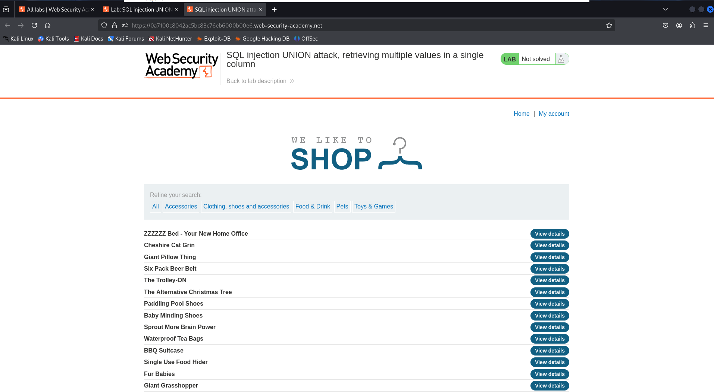
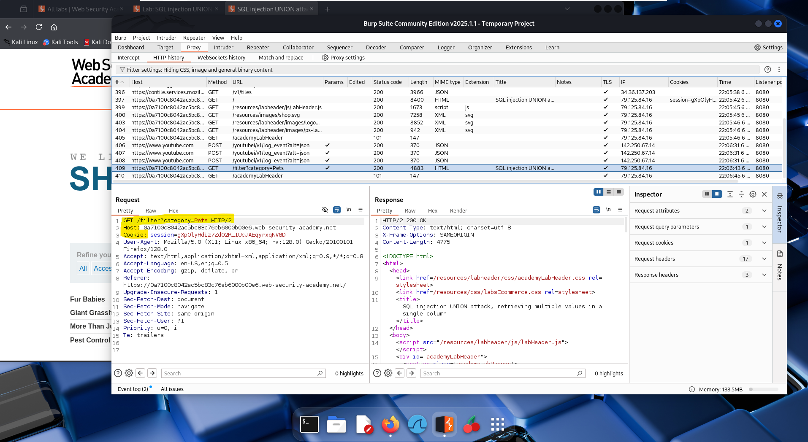
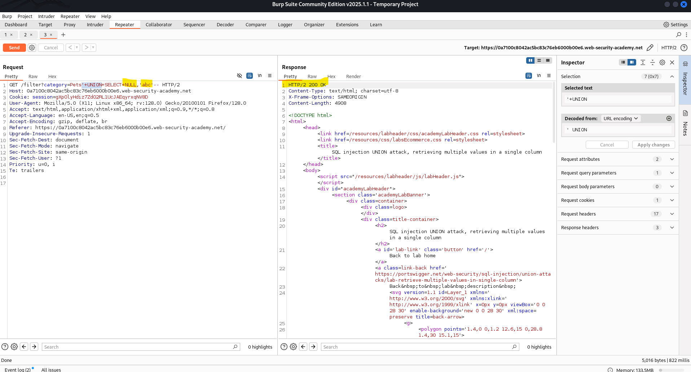
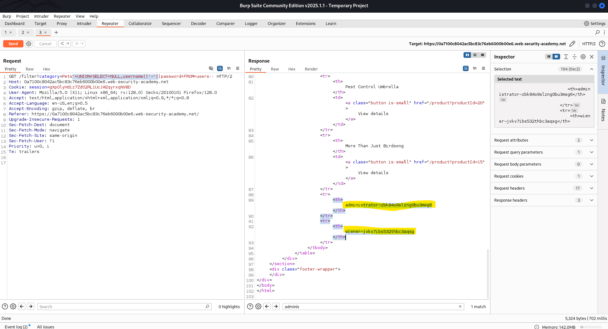
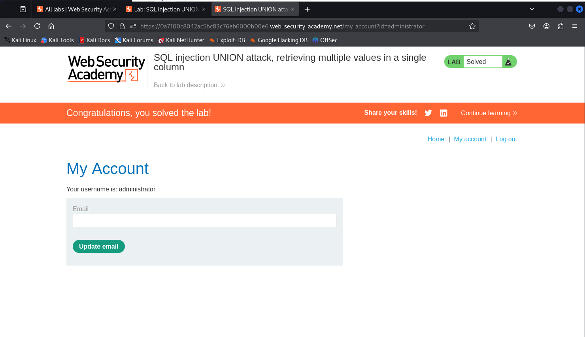

# 🧪 Lab: SQL injection UNION attack, retrieving multiple values in a single column

## 🎯 Objective
Exploit a SQL injection vulnerability using a UNION-based attack to retrieve multiple values (usernames and passwords) from the `users` table and use the credentials to log in as the `administrator`.

---

## 🧭 Steps

### 1️⃣ Access the Lab
Open the lab and note the goal: extract all usernames and passwords using SQL injection.



---

### 2️⃣ Intercept the Category Filter Request
Using Burp Suite, click a product category and intercept the request. Send the request to Repeater.



---

### 3️⃣ Identify Text-Compatible Column
Test how many columns exist and which one can store text:

Payload used:
```
'+UNION+SELECT+NULL,'abc'--
```

If you see 'abc' displayed on the response page, that column accepts string values.



---

### 4️⃣ Retrieve Credentials
Exploit the vulnerability to fetch data from the `users` table using string concatenation (`||`) to combine username and password in a single column.

Payload used:
```
'+UNION+SELECT+NULL,username||'~'||password+FROM+users--
```

Look for output like:  
`administrator~zbk84o9slzng0bu3msg6`  
`wiener~jvkv7ibs532thbc3aqsg`



---

### 5️⃣ Log in as Administrator
Use the stolen credentials to log in via the "My account" link.

Username: `administrator`  
Password: (from the response above)

Success is confirmed when the following message appears:

**“Congratulations, you solved the lab!”**



---

## ✅ Conclusion
This lab demonstrates how to extract sensitive information using UNION-based SQL injection when only one column accepts string data. It combines text compatibility testing and query concatenation for effective exploitation.