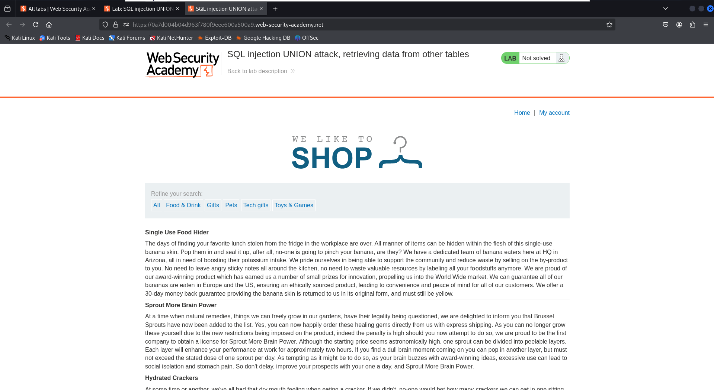
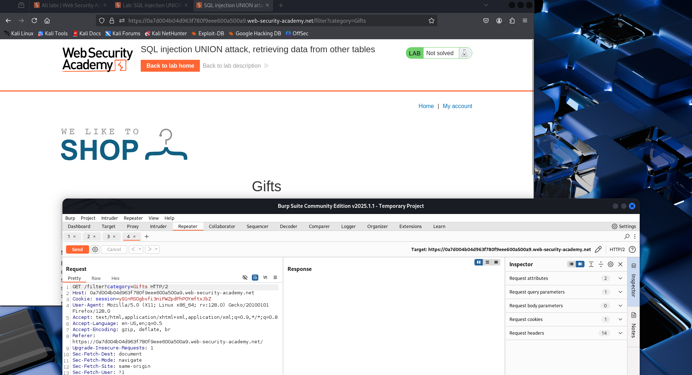
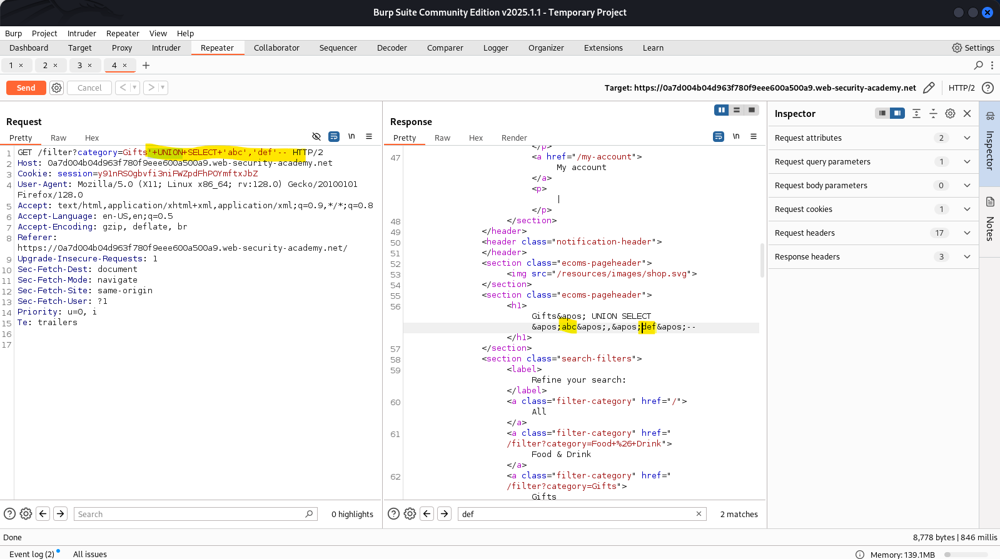

# 🧪 Lab: SQL injection UNION attack, retrieving data from other tables

## 🎯 Objective
This lab demonstrates how to perform a SQL injection UNION attack to extract data from a different table (`users`) and log in as the `administrator` user.

---

## 🧭 Steps

### 1️⃣ Access the Lab
Launch the lab and take note of the goal: retrieve `username` and `password` from the `users` table.



---

### 2️⃣ Intercept the Product Category Request
Use Burp Suite to click a category and intercept the request. Send it to Repeater.



---

### 3️⃣ Determine Column Count and Text Compatibility
Use this payload to test how many columns are returned and whether both accept text:
```
'+UNION+SELECT+'abc','def'--
```

If the query works and the response is valid, it confirms two columns are returned and both accept string data.



---

### 4️⃣ Retrieve User Credentials
Inject the following UNION SELECT payload:
```
'+UNION+SELECT+username,+password+FROM+users--
```

The response should include usernames and passwords from the `users` table.


---

### 5️⃣ Log in as Administrator
Use the retrieved credentials to log in as `administrator` and complete the lab.


---

## ✅ Conclusion
This lab combines knowledge from previous SQLi tasks to extract sensitive data from another table. Identifying correct column structure and data types is crucial for successful exploitation.
